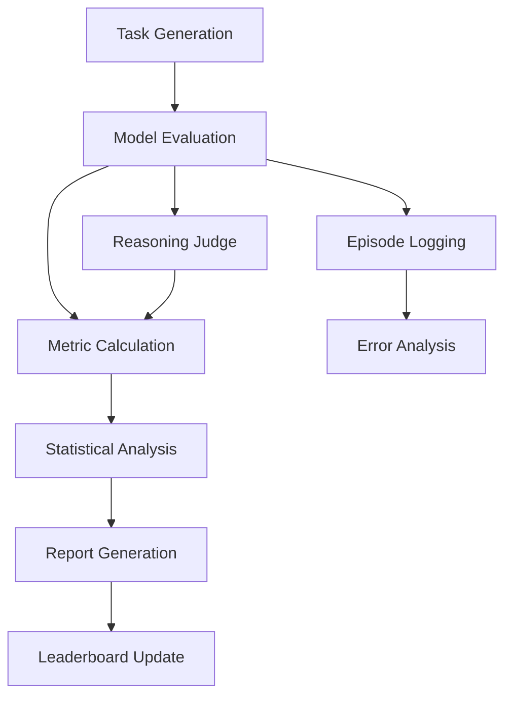

# Minesweeper AI Benchmark - Comprehensive Evaluation Plan

## Executive Summary

This document outlines a comprehensive plan for evaluating Large Language Models (LLMs) on the Minesweeper AI Benchmark. The plan incorporates industry best practices from 2025, the MineBench specification requirements, and practical implementation strategies.

## 1. Evaluation Objectives

### Primary Goals
1. **Assess Reasoning Capabilities**: Measure logical deduction and strategic planning
2. **Compare Model Performance**: Enable fair comparisons across different LLMs
3. **Track Progress**: Monitor improvements in AI reasoning over time
4. **Identify Weaknesses**: Discover failure modes and areas for improvement

### Success Criteria
- Achieve statistical significance in model comparisons (p < 0.05)
- Maintain evaluation reproducibility (>99% consistency)
- Complete evaluations within reasonable time/cost budgets
- Generate actionable insights for model improvement

## 2. Evaluation Framework

### 2.1 Multi-Stage Evaluation Pipeline



### 2.2 Evaluation Stages

#### Stage 1: Baseline Establishment (Week 1-2)
- Evaluate 5 reference models (GPT-4, Claude-3, GPT-3.5, Gemini, Llama)
- Establish performance baselines for each metric
- Calibrate reasoning judge against human annotations
- Document evaluation procedures

#### Stage 2: Comprehensive Testing (Week 3-4)
- Run full evaluation suite on all models
- Test multiple prompt variants per model
- Collect detailed performance data
- Perform statistical analysis

#### Stage 3: Advanced Analysis (Week 5-6)
- Conduct error analysis and failure mode identification
- Test adversarial examples and edge cases
- Evaluate model robustness and consistency
- Generate insights and recommendations

## 3. Task Design and Curation

### 3.1 Task Distribution

| Task Type | Count | Difficulty Distribution | Purpose |
|-----------|-------|------------------------|---------|
| MS-S (Static) | 1000 | 20% Easy, 50% Medium, 30% Hard | Logical deduction |
| MS-I (Interactive) | 200 | 25% Easy, 50% Medium, 25% Hard | Strategic planning |
| Edge Cases | 100 | 100% Hard | Robustness testing |
| Adversarial | 50 | 100% Hard | Failure mode analysis |

### 3.2 Task Quality Criteria
- **Solvability**: All tasks must have deterministic solutions
- **Diversity**: Cover various board configurations and game states
- **Clarity**: Unambiguous correct answers for static tasks
- **Balance**: No systematic biases favoring specific strategies

### 3.3 Data Splits
- **Public Split (80%)**: For development and public leaderboard
- **Hidden Split (20%)**: For blind evaluation and overfitting prevention
- **Rotation Schedule**: Refresh 10% of tasks quarterly

## 4. Model Evaluation Protocol

### 4.1 Standard Evaluation Parameters
```python
EVALUATION_CONFIG = {
    "temperature": 0.0,  # Deterministic outputs
    "max_tokens": 1000,  # Sufficient for reasoning
    "timeout": 30,       # Seconds per move
    "retries": 3,        # For transient errors
    "seed": 42,          # Reproducibility
}
```

### 4.2 Evaluation Scenarios

#### Scenario A: Quick Assessment (2 hours)
- 100 static tasks + 20 interactive games
- Single prompt variant
- Basic metrics only
- Use case: Rapid model screening

#### Scenario B: Standard Evaluation (8 hours)
- 500 static tasks + 100 interactive games
- 3 prompt variants
- Full metrics including reasoning scores
- Use case: Leaderboard submission

#### Scenario C: Comprehensive Evaluation (24 hours)
- 1000 static tasks + 200 interactive games
- 5+ prompt variants
- Advanced metrics and error analysis
- Use case: Research and publication

### 4.3 Cost Estimation

| Model | Cost per 1K tokens | Standard Eval Cost | Comprehensive Cost |
|-------|-------------------|-------------------|-------------------|
| GPT-4 | $0.03/$0.06 | ~$50 | ~$150 |
| Claude-3 | $0.025/$0.125 | ~$45 | ~$135 |
| GPT-3.5 | $0.001/$0.002 | ~$5 | ~$15 |

## 5. Metrics and Scoring

### 5.1 Core Metric Hierarchy

```
Global Score (GMS)
├── MS-S Score (40% weight)
│   ├── Accuracy (70%)
│   ├── Valid Output Rate (10%)
│   └── Reasoning Score (20%)
└── MS-I Score (60% weight)
    ├── Win Rate (50%)
    ├── Coverage (20%)
    ├── Valid Move Rate (10%)
    ├── Flag Metrics (10%)
    └── Reasoning Score (10%)
```

### 5.2 Advanced Metrics

#### Efficiency Metrics
- **Move Efficiency**: Actual moves / Optimal moves
- **Time Efficiency**: Median time per move
- **Token Efficiency**: Tokens used / Move quality

#### Robustness Metrics
- **Consistency Score**: Performance variance across similar tasks
- **Recovery Rate**: Success after errors
- **Adversarial Resistance**: Performance on edge cases

#### Reasoning Quality Dimensions
1. **Correctness**: Logical validity of reasoning
2. **Completeness**: Coverage of relevant factors
3. **Clarity**: Understandability of explanations
4. **Efficiency**: Conciseness without loss of meaning

### 5.3 Statistical Analysis Plan

#### Hypothesis Testing
- **Primary**: Model A win rate > Model B win rate
- **Secondary**: Reasoning quality correlates with performance
- **Method**: Two-proportion z-test, Pearson correlation

#### Confidence Intervals
- Wilson score method for proportions
- Bootstrap for complex metrics
- 95% confidence level standard

#### Sample Size Calculations
```python
# Minimum games to detect 10% win rate difference
from statsmodels.stats.power import zt_ind_solve_power

n = zt_ind_solve_power(
    effect_size=0.1,  # 10% difference
    alpha=0.05,       # Significance level
    power=0.8,        # Statistical power
    ratio=1           # Equal sample sizes
)
# Result: ~155 games per model
```

## 6. Implementation Timeline

### Phase 1: Infrastructure Setup (Week 1)
- [ ] Configure evaluation environment
- [ ] Set up logging and monitoring
- [ ] Implement statistical analysis tools
- [ ] Create evaluation dashboards

### Phase 2: Baseline Evaluation (Week 2-3)
- [ ] Generate comprehensive task set
- [ ] Evaluate reference models
- [ ] Calibrate reasoning judge
- [ ] Establish baseline metrics

### Phase 3: Full Evaluation (Week 4-6)
- [ ] Run comprehensive evaluations
- [ ] Collect performance data
- [ ] Perform statistical analysis
- [ ] Generate initial reports

### Phase 4: Analysis and Reporting (Week 7-8)
- [ ] Conduct error analysis
- [ ] Identify improvement opportunities
- [ ] Create visualizations
- [ ] Publish results

## 7. Quality Assurance

### 7.1 Evaluation Validity Checks
- **Reproducibility Tests**: Run same evaluation 3x, verify <1% variance
- **Judge Calibration**: Human review of 5% sample
- **Data Integrity**: Checksums for all task files
- **Result Validation**: Automated sanity checks

### 7.2 Continuous Monitoring
```python
MONITORING_METRICS = {
    "api_latency": "p50, p95, p99",
    "error_rate": "< 1%",
    "judge_agreement": "> 85% with humans",
    "cost_per_eval": "track and alert if +20%"
}
```

### 7.3 Audit Schedule
- **Weekly**: Spot check 10 random evaluations
- **Monthly**: Full judge calibration review
- **Quarterly**: Comprehensive framework assessment
- **Annually**: Major version update consideration

## 8. Evaluation Best Practices

### 8.1 Pre-Evaluation Checklist
- [ ] Verify model configuration (temperature=0)
- [ ] Check API rate limits and quotas
- [ ] Ensure sufficient disk space for logs
- [ ] Confirm task file integrity
- [ ] Test network stability

### 8.2 During Evaluation
- Monitor real-time metrics dashboard
- Check for anomalous patterns
- Maintain evaluation logs
- Handle errors gracefully
- Save intermediate results

### 8.3 Post-Evaluation
- Verify data completeness
- Run statistical analyses
- Generate visualizations
- Archive raw results
- Update documentation

## 9. Error Handling and Edge Cases

### 9.1 Common Issues and Mitigations

| Issue | Detection | Mitigation |
|-------|-----------|------------|
| API Timeout | Latency > 30s | Retry with backoff |
| Invalid Output | Parse failure | Fall back to text extraction |
| Rate Limiting | 429 errors | Reduce parallelism |
| Model Refusal | "Cannot assist" | Log and skip task |

### 9.2 Edge Case Handling
- **Ambiguous Boards**: Multiple valid solutions
- **Unsolvable States**: No guaranteed safe moves
- **Model Hallucinations**: Impossible moves
- **Context Overflow**: Very large boards

## 10. Reporting and Visualization

### 10.1 Standard Reports

#### Executive Summary
- Overall performance comparison
- Key findings and insights
- Recommendations

#### Detailed Analysis
- Metric breakdowns
- Error analysis
- Statistical significance tests
- Performance trends

#### Technical Appendix
- Full methodology
- Raw data tables
- Statistical calculations
- Reproducibility information

### 10.2 Visualization Standards
```python
VISUALIZATION_REQUIREMENTS = {
    "charts": ["win_rate_comparison", "metric_radar", "error_distribution"],
    "tables": ["leaderboard", "statistical_summary", "error_catalog"],
    "formats": ["PNG", "SVG", "interactive_HTML"],
    "style": "consistent_with_brand_guidelines"
}
```

## 11. Continuous Improvement

### 11.1 Feedback Loops
1. **Model Developer Feedback**: Share detailed error analyses
2. **Community Input**: Collect suggestions for new metrics
3. **Research Integration**: Incorporate latest evaluation techniques
4. **User Studies**: Validate metric relevance

### 11.2 Quarterly Review Process
1. Analyze evaluation framework effectiveness
2. Review metric correlations with real-world performance
3. Update task sets based on findings
4. Refine statistical methods
5. Publish methodology updates

### 11.3 Innovation Pipeline
- **Q1 2025**: Implement multi-model collaborative evaluation
- **Q2 2025**: Add explainability metrics
- **Q3 2025**: Introduce adaptive difficulty adjustment
- **Q4 2025**: Deploy real-time evaluation capabilities

## 12. Conclusion

This evaluation plan provides a comprehensive framework for assessing LLM performance on Minesweeper tasks. By following these guidelines, we can ensure:

1. **Fair Comparisons**: Standardized conditions for all models
2. **Statistical Rigor**: Confidence in reported differences
3. **Actionable Insights**: Clear paths for improvement
4. **Reproducibility**: Consistent results across evaluations
5. **Continuous Evolution**: Framework improvements over time

The plan balances thoroughness with practicality, enabling both quick assessments and deep analyses as needed. Regular reviews and updates will ensure the framework remains relevant as AI capabilities advance.

## Appendices

### A. Evaluation Checklist Template
```markdown
## Pre-Evaluation Checklist

**Date**: ___________  
**Evaluator**: ___________  
**Models**: ___________

### Environment Setup
- [ ] Python environment activated
- [ ] Dependencies installed and versions logged
- [ ] API keys configured and tested
- [ ] Storage space verified (min 10GB free)

### Configuration
- [ ] Evaluation config reviewed
- [ ] Model parameters set (temperature=0)
- [ ] Logging configured
- [ ] Monitoring dashboard accessible

### Data Preparation
- [ ] Task files downloaded and verified
- [ ] Checksums validated
- [ ] Data splits confirmed
- [ ] Prompt templates loaded

### Execution
- [ ] Dry run completed successfully
- [ ] Resource monitoring active
- [ ] Backup system enabled
- [ ] Error notifications configured

### Post-Processing
- [ ] Results backup created
- [ ] Statistical analysis scripts ready
- [ ] Report templates prepared
- [ ] Visualization tools tested
```

### B. Sample Evaluation Command
```bash
# Comprehensive evaluation with all features
python -m src.cli.main evaluate \
    --model gpt-4 \
    --model-provider openai \
    --task-split public \
    --num-static 1000 \
    --num-interactive 200 \
    --prompt-variants cot_v1,cot_v2,standard \
    --use-reasoning-judge \
    --parallel-games 5 \
    --save-episodes \
    --calculate-significance \
    --generate-report \
    --output-dir ./evaluations/2025-01-13-gpt4
```

### C. References
1. MineBench: A Systematic Evaluation Framework (2025)
2. "Evaluating LLMs as Judges" - Anthropic (2024)
3. "Statistical Methods for AI Evaluation" - Stanford (2025)
4. "Best Practices for LLM Benchmarking" - Google Research (2025)
5. ISO/IEC 25040:2011 - Systems and software Quality Requirements and Evaluation