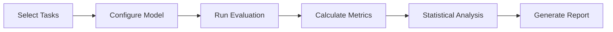

# Evaluation Documentation Summary

This directory contains comprehensive documentation for the Minesweeper AI Benchmark evaluation framework.

## Document Overview

### 1. [Evaluation Guide](./evaluation.md)
**Purpose**: Complete guide to the evaluation methodology, metrics, and implementation  
**Audience**: Developers, researchers, and users running evaluations  
**Key Topics**:
- Evaluation philosophy and principles
- Task taxonomy (MS-S and MS-I)
- Detailed metric definitions
- Statistical analysis methods
- Implementation examples
- Best practices

### 2. [Evaluation Plan](./evaluation-plan.md)
**Purpose**: Detailed roadmap for conducting comprehensive model evaluations  
**Audience**: Project managers, researchers planning evaluation studies  
**Key Topics**:
- Multi-stage evaluation pipeline
- Task design and curation
- Cost and time estimates
- Quality assurance procedures
- Continuous improvement processes

### 3. [Evaluation Spec Implementation](./evaluation-spec-implementation.md)
**Purpose**: Technical details on MineBench specification implementation  
**Audience**: Developers implementing evaluation features  
**Key Topics**:
- LLM judge implementation
- Advanced metrics calculators
- Episode logging system
- Data split management
- Compliance status

## Quick Links

### For Users
- **Run an evaluation**: See [Quick Start](./quickstart.md#running-evaluations)
- **Interpret results**: See [Metrics](./evaluation.md#evaluation-metrics)
- **Compare models**: See [Statistical Analysis](./evaluation.md#statistical-analysis)

### For Developers
- **Add custom metrics**: See [Implementation Guide](./evaluation.md#custom-metrics)
- **Extend evaluation**: See [Plugin Development](./plugin-development.md)
- **Debug issues**: See [Troubleshooting](./evaluation.md#troubleshooting)

### For Researchers
- **Methodology details**: See [Evaluation Philosophy](./evaluation.md#evaluation-philosophy)
- **Statistical rigor**: See [Statistical Analysis](./evaluation.md#statistical-analysis)
- **Reproduce results**: See [Best Practices](./evaluation.md#best-practices)

## Key Concepts

### Task Types
- **MS-S (Static)**: Single-turn prediction tasks for logical deduction
- **MS-I (Interactive)**: Multi-turn full games for strategic planning

### Core Metrics
- **Accuracy (ACC)**: Correct predictions for static tasks
- **Win Rate (WR)**: Percentage of games won
- **Coverage (COV)**: Board exploration efficiency
- **Reasoning Score (RS)**: Quality of explanations

### Composite Scores
- **MS-S Score**: Weighted combination of static task metrics
- **MS-I Score**: Weighted combination of interactive game metrics
- **Global MineBench Score**: Overall performance across all tasks

## Evaluation Workflow



## Best Practices Summary

1. **Use deterministic settings** (temperature=0) for reproducibility
2. **Run sufficient trials** (100+ games) for statistical significance
3. **Include reasoning evaluation** for comprehensive assessment
4. **Test multiple prompt variants** to find optimal performance
5. **Monitor costs and performance** during evaluation
6. **Archive raw results** for future analysis

## Getting Started

### Basic Evaluation
```bash
python -m src.cli.main evaluate --model gpt-4 --num-games 100
```

### Advanced Evaluation
```bash
python -m src.cli.main evaluate \
    --model gpt-4 \
    --num-games 200 \
    --use-reasoning-judge \
    --calculate-significance \
    --generate-report
```

## Support

- **GitHub Issues**: Report bugs or request features
- **Discord Community**: Discuss evaluation strategies
- **Email Support**: research@minebench.ai

## Future Developments

- Real-time evaluation dashboard
- Automated leaderboard updates
- Multi-model collaborative evaluation
- Advanced visualization tools
- Custom metric marketplace

---

*Last updated: January 2025*